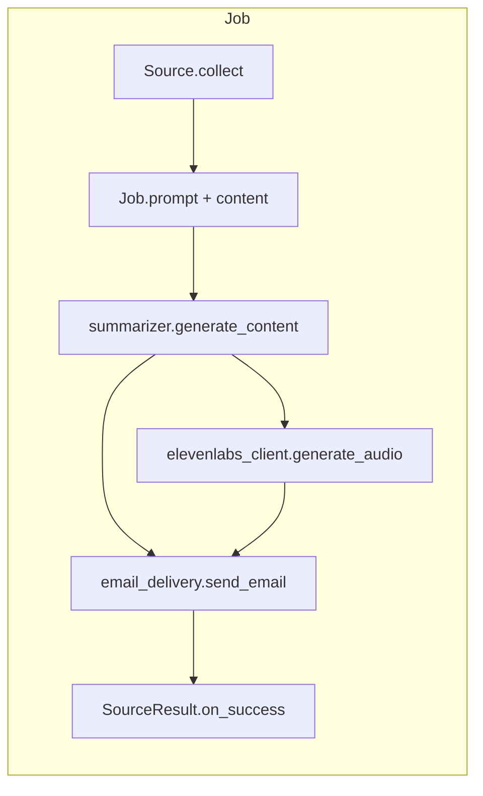

# Transcript summarizer

A **template** for Python pipelines that collect text, summarize it with **Gemini**, and deliver styled emails through **Gmail**. Every job follows the same shape:

**text → LLM + prompt → email** (optional **MP3** for daily jobs)



This repo ships two **worked examples** you can copy and adapt:

1. **NPR Indicator** (`npr_indicator`) — scrape podcast transcripts from RSS + HTML (the primary extension example).
2. **Newsletter example** (`newsletter_example`) — read allowlisted senders from a Gmail inbox (placeholder senders; replace with yours).

Delivery, HTML rendering, Gemini retry/fallback, optional ElevenLabs TTS, and CI plumbing are shared — you usually only add a `Source` + `Job`.

## Requirements

- Python 3.11+ (matches CI)
- [Gemini API key](https://ai.google.dev/)
- Gmail account with 2FA + [App Password](https://myaccount.google.com/apppasswords) (IMAP read + email delivery)
- **Audio briefings (optional):** [ElevenLabs](https://elevenlabs.io/) API key with `text_to_speech` and `voices_read` permissions

## Quick start

```bash
python -m venv venv
source venv/bin/activate   # Windows: venv\Scripts\activate
pip install -r requirements.txt
cp .env.example .env       # add GEMINI_API_KEY, GMAIL_ADDRESS, GMAIL_APP_PASSWORD
```

## Run jobs

```bash
# Safe test: collect + summarize, no send, no post-delivery hooks
python run.py --dry-run

# Example Gmail job (replace senders in jobs/definitions.py first)
python run.py --dry-run --only newsletter_example

# Weekly NPR Indicator summary
python run.py --dry-run --only npr_indicator

# Run by schedule group
python run.py --group daily
python run.py --group weekly
```

`--dry-run` does not call ElevenLabs; audio is only generated on live **daily** runs when `ELEVENLABS_API_KEY` is set.

### Built-in example jobs

| Key | Group | Description |
|-----|-------|-------------|
| `newsletter_example` | daily | Gmail inbox briefing (placeholder senders — customize before use) |
| `npr_indicator` | weekly | NPR Indicator transcript digest (RSS + scrape) |

### Tests

```bash
pytest -q
```

## Environment variables

| Variable | Required | Purpose |
|----------|----------|---------|
| `GEMINI_API_KEY` | Yes | Gemini API access |
| `GEMINI_MODELS` | No | Comma-separated model priority list (default: `gemini-3-flash-preview,gemini-2.5-flash`). Falls back when daily quota is exhausted. |
| `GEMINI_MODEL` | No | Legacy single-model override (used only when `GEMINI_MODELS` is unset) |
| `GMAIL_ADDRESS` | Yes | Gmail address for IMAP + delivery |
| `GMAIL_APP_PASSWORD` | Yes | Gmail app password |
| `BRIEFING_TO_EMAIL` | No | Email recipient (defaults to `GMAIL_ADDRESS`) |
| `BRIEFING_DELIVERY` | No | `imap` (default for self-send) or `smtp` |
| `BRIEFING_LOOKBACK_HOURS` | No | Inbox lookback window (default `24`) |
| `ELEVENLABS_API_KEY` | No | If set, daily jobs attach an MP3 audio briefing (ElevenLabs `eleven_turbo_v2_5`) |
| `SUMMARY_WEEK_REFERENCE` | No | Pin NPR calendar week for testing |

## Project layout

| Path | Role |
|------|------|
| `run.py` | CLI entry point |
| `jobs/` | Job registry, runner, and example definitions |
| `jobs/base.py` | `Job`, `Source`, `SourceResult`, `run_job()` |
| `jobs/sources.py` | `GmailSource`, `NprIndicatorSource` |
| `jobs/definitions.py` | Example job configs and prompts — **start here** |
| `email_delivery.py` | Gmail delivery (IMAP inbox append or SMTP) |
| `email_html.py` | Shared Markdown → styled HTML |
| `summarizer.py` | Gemini client with retry logic and model fallback |
| `gmail_client.py` | Gmail IMAP read + mark-as-read |
| `elevenlabs_client.py` | Optional ElevenLabs TTS for MP3 audio briefings |
| `scraper.py` | NPR RSS + transcript fetch — **copy for other podcasts** |
| `summaries/` | Saved NPR weekly summaries (`on_success` hook) |

## Audio briefings

When `ELEVENLABS_API_KEY` is set, each live **daily** job also generates an MP3 via ElevenLabs and attaches it to the email as `briefing.mp3`.

- **Model:** `eleven_turbo_v2_5`
- **Voice:** Callum (default voice ID in `elevenlabs_client.py`)
- **Dry run:** `--dry-run` skips ElevenLabs to avoid API usage
- **Weekly jobs:** NPR summaries are text-only (no audio attachment)
- **Failure behavior:** If audio generation fails, the text briefing still sends

The pipeline strips markdown formatting via `clean_for_tts()` before sending text to ElevenLabs so headings and links sound natural when spoken.

Create a restricted ElevenLabs API key with only `text_to_speech` and `voices_read`. MP3 attachments are a few MB each; consider a Gmail filter to auto-delete briefing emails after ~14 days.

To change the voice, pass a different `voice_id` to `generate_audio()` in [`elevenlabs_client.py`](elevenlabs_client.py).

## Customize the NPR scraper (extension example)

[`scraper.py`](scraper.py) and [`NprIndicatorSource`](jobs/sources.py) show how to wire web scraping into the pipeline:

| Customize | Where |
|-----------|--------|
| RSS feed URL | `scraper.RSS_URL` |
| Transcript link from RSS entry | `scraper._transcript_url()` |
| HTML content selector | `scraper.fetch_transcript()` |
| Calendar week bounds | `scraper.get_episodes_for_calendar_week()` |
| Output file path | `jobs/sources._save_npr_summary()` |

For a different podcast or site: copy `scraper.py`, adjust the selectors, add a new `Source` class, and register a `Job`.

## Customize the Gmail inbox path

1. Open [`jobs/definitions.py`](jobs/definitions.py).
2. Replace `newsletter@example.com` with your newsletter sender addresses.
3. Edit the prompt for your tone and structure.
4. Optionally add an `include_filter` on `GmailSource` to skip unwanted editions (see `GmailSource` in [`jobs/sources.py`](jobs/sources.py)).

Duplicate the example job for multiple categories (e.g. tech, sports) with different sender lists and prompts.

## Add a new job from scratch

You do **not** need to touch delivery, HTML rendering, Gemini calls, or TTS wiring.

### 1. Write a `Source`

```python
from jobs.base import SourceResult

class MyCustomSource:
    def collect(self) -> SourceResult:
        text = my_scraper_or_script()
        if not text.strip():
            return SourceResult(prompt_text="", has_content=False)

        return SourceResult(
            prompt_text=f"Here is the content to summarize:\n\n{text}",
            has_content=True,
            dry_run_summary="Optional note printed during --dry-run",
            on_success=lambda markdown: save_artifact(markdown),
        )
```

### 2. Register a `Job`

Add to [`jobs/definitions.py`](jobs/definitions.py):

```python
Job(
    key="my_job",
    display_name="My Job",
    group="daily",
    subject_prefix="My Job Briefing",
    intro_template="Your briefing for <strong>{date}</strong> is below.",
    prompt="You are an expert editor. Summarize the following...",
    build_source=lambda: MyCustomSource(),
    markdown_prefix="# My Job - {date}\n\n",
)
```

Daily jobs with `group="daily"` automatically get MP3 attachments when `ELEVENLABS_API_KEY` is set.

### 3. Test and run

```bash
pytest -q
python run.py --dry-run --only my_job
python run.py --only my_job
```

## GitHub Actions

Configure repository secrets: `GEMINI_API_KEY`, optional `GEMINI_MODELS` (or legacy `GEMINI_MODEL`), `GMAIL_ADDRESS`, `GMAIL_APP_PASSWORD`, optional `ELEVENLABS_API_KEY`.

### Daily newsletter (example)

[`.github/workflows/daily-briefing.yml`](.github/workflows/daily-briefing.yml) — **manual dispatch only** by default. Add a `schedule` cron when your Gmail job is configured.

Runs `python run.py --group daily`.

### Weekly NPR Indicator

[`.github/workflows/summarize.yml`](.github/workflows/summarize.yml) — Friday 22:00 UTC + manual dispatch.

Runs `python run.py --group weekly`. Summaries are saved locally via `on_success`; add a git commit step if you want them pushed to the repo.

### Tests

[`.github/workflows/tests.yml`](.github/workflows/tests.yml) runs `pytest` on push/PR.

## License

MIT — see [LICENSE](LICENSE).
